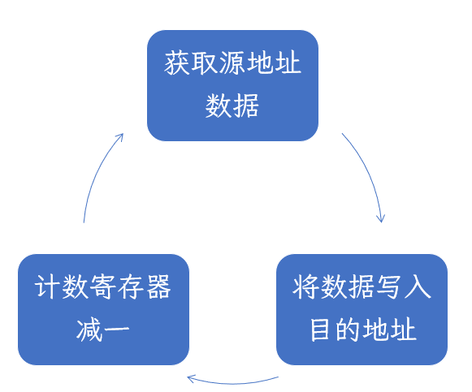
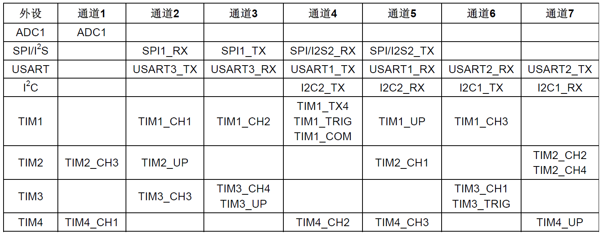
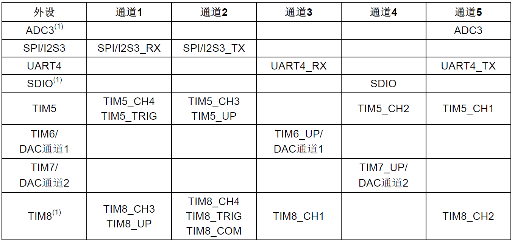

# DMA

DMA (Direct Memory Access)直接存储器存取：它能够进行存储器和外设寄存器之间、存储器和存储器之间的数据转移，而且不占用什么CPU的资源。

STM32有两个DMA控制器共12个通道（DMA1有7个，DMA2有5个），每个通道都管理着一个或几个外设的对存储器的请求，这些通道最终有一个仲裁器进行优先级判断。

## DMA开启的三个条件

- 传输数据数目不为0。

- 有触发源（专门的硬件请求或软件触发）。

- 使能DMA通道。

## DMA主要特性

- 12个独立的请求通道。

- 每个通道都有<u>专门的硬件请求</u>，也支持<u>软件触发</u>，这些可以通过软件配置。

- 多个外设请求同一个DMA模块时，优先级可以有软件编程设置。优先级相同时，<u>低通道</u>优先。

- 数据源和目的数据区都支持三种字宽（字节、半字、全字）。

- 支持循环缓冲器管理。

- 每个通道都有三个事件标志（<u>DMA半传输</u>、<u>DMA传输完成</u>和<u>DMA传输出错</u>），这三个事件标准<u>逻辑或</u>成为一个独立的事件标志。

- 传输数据数目可编程，最大为65535。

DMA与CPU共享系统数据总线，当CPU和DMA同时访问相同外设时，DMA请求会<u>暂停CPU访问系统总线</u>若干个周期，总线仲裁器执行循环调度，保证CPU至少拥有一半的系统总线带宽。

## DMA处理过程

外设向DMA控制器发送一个请求信号，DMA控制器根据通道的优先权处理请求。当DMA控制器开始访问发出请求的外设时，DMA控制器立即给它发送一个应答信号。当外设得到DMA控制器的应答信号，立即释放请求。一旦外设释放了请求，DMA控制器同时撤销应答信号。如果还有请求，进入下一个周期。

如果是正常模式，计数寄存器减到0就停止运行。如果是循环模式，计数寄存器减到0后，自动重装计数值继续执行。

## DMA请求表

### DMA1请求表

### DMA2请求表

