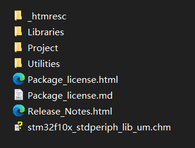
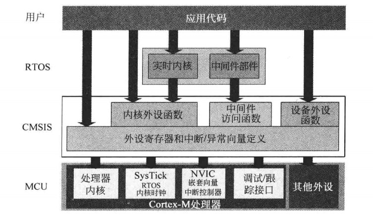
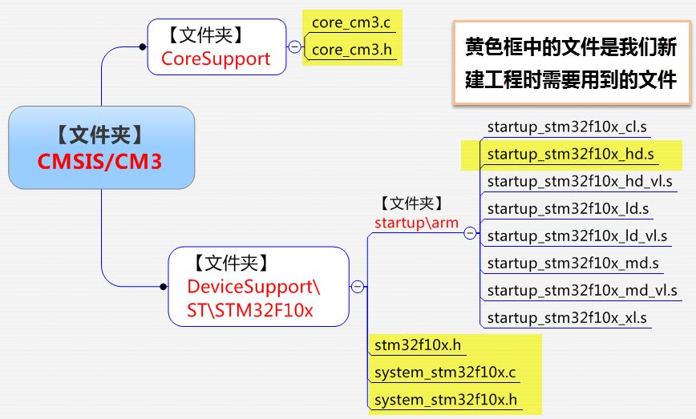
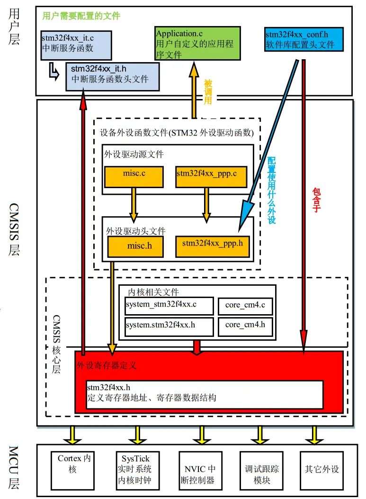

# 新建STM32标准库工程

---

## 下载官方标准外设库固件

https://www.st.com/zh/embedded-software/stm32-standard-peripheral-libraries.html

### 官方标准外设库文件介绍

| 文件夹       | 内容           |
|:---------:|:------------:|
| Libraries | 驱动库的源代码和启动文件 |
| Project   | 驱动示例和工程模板    |
| Utilities | 基于官方评估板的例程   |

在创建标准库工程时，主要移植的是**Libraries**文件夹中的文件，其中提供了内核文件和驱动库文件。

打开Libraries文件夹可以看见内部只有两个文件夹：CMSIS文件夹和STM32F10x_StdPeriph_Driver文件夹。

#### CMSIS

CMSIS (Cortex Microcontroller Software Interface Standard)是ARM公司为了能让不同的芯片公司生产的Cortex-M系列芯片能在软件上基本兼容，与芯片生产商共同提出的软件接口标准。

CMSIS项目通过不断的更新，现在已经成为了CMSIS-Core，其他的CMSIS项目也已经启动：

- CMSIS-Core

- CMSIS-DSP

- CMSIS-SVD

- CMSIS-RTOS

- CMSIS-DAP

##### CMSIS-Core

CMSIS-Core所实现的标准化：

- 处理器外设的标准化。比如嵌套向量中断控制器(NVIC)、系统控制快(SCB)中的多个可编程寄存器等。

- 访问处理器特性的标准化函数。包括使用NVIC进行中断控制的多个函数以及访问处理器中特殊寄存器的函数。

- 操作特殊指令的标准化函数。Cortex-M系列处理器支持几个特殊目的的指令（例如等待中断WFI、用于进入休眠模式）。CMSIS实现了一组函数，C程序代码可以利用这些函数实现特殊指令。

- 系统异常处理的标准化命名。

- **系统初始化的标准函数**。在应用程序开始前需要配置时钟电路和电源管理寄存器，在符合CMSIS的设备驱动库中，这些配置过程由SystemInit()实现。

- 描述时钟频率的标准化变量。

CMSIS-Core的组织结构：

##### CMSIS-Core移植

1. 头文件移植
   
   - 用于外设寄存器定义和中断分配定义的设备相关的头文件（如 <device>.h）。
   
   - 用于设备初始化代码的设备相关头文件（如 system_<device>.h）。
   
   - 用于内核寄存器定义的头文件（如 core_cm3.h, core_cm4.h 等，他们实现了内核寄存器的映射）。

2. 源文件移植
   
   - 设备、工具链相关的启动代码。
   
   - 设备相关的设备初始化代码（如 system_<device>.c）。
   
   - 对于CMSIS-Core库的CMSIS 2.00或者之前的版本，为了访问内核寄存器，还需要将用于操作内核外设寄存器的源文件（如 core_cm3.c）添加到工程中，但从CMSIS 2.10版本开始就不再需要了。

从官方下载的CMSIS文件夹目录如下：

图中黄色高亮为移植文件。

启动文件的选择：

| 启动文件                     | 区别                     | 含义                      |
|:------------------------:|:----------------------:|:----------------------- |
| startup_<device>.ld.s    | ld : low-density       | Flash容量在16~32K之间        |
| startup_<device>.md.s    | md : medium-density    | Flash容量在64~128K之间       |
| startup_<device>.hd.s    | hd : high-density      | Flash容量在128~512K之间      |
| startup_<device>.xl.s    | xl : XL-density        | Flash容量在512~1024K之间     |
| startup_<device>.cl.s    | cl : connectivity line | 互联型系列，特指F105xx，F107xx系列 |
| startup_<device>.ld.vl.s | vl : value line        | 超值型系列，特指F100xx系列        |

#### STM32F10x_StdPeriph_Driver

STM32F10x_StdPeriph_Driver文件夹中有两个文件夹：inc和src。这两个文件夹中存放着ST公司针对每个STM32外设编写的库函数文件。

这个文件夹中的文件都要进行移植。

#### 其他文件

除了上述文件，还需要移植一些在官方模板中的文件：<device>.it.c, <device>.it.h 和 <device>.config.h。他们都在Project文件夹下的Template文件夹下。

- <device>.it.c 和 <device>.it.h
  
  这两个文件用来编写中断服务函数的，文件已经定义了一些系统异常（特殊中断）的接口。

- <device>.config.h
  
  这个文件包含了<device>.h文件和所有的外设驱动库的头文件。

## 库文件间关系

除了用户层的文件可以更改，其他层的文件尽量不要更改。
